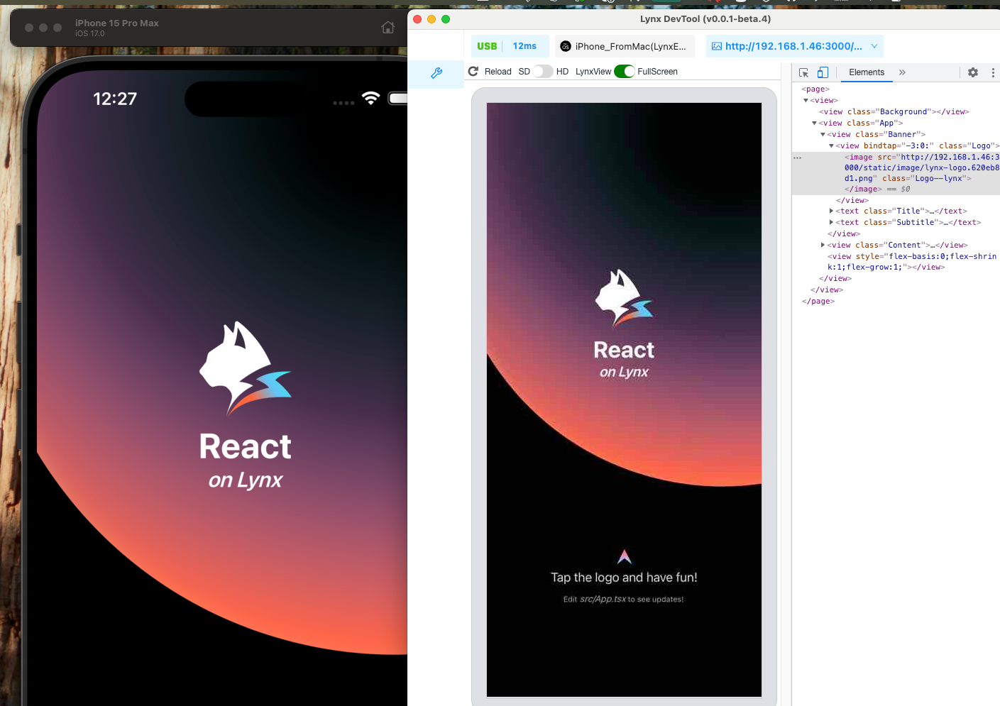

# Lynx-101

## Rspeedy project

This is a ReactLynx project bootstrapped with `create-rspeedy`.

## Getting Started

First, install the dependencies:

```bash
pnpm install
```

Then, run the development server:

```bash
pnpm run dev
```

Scan the QRCode in the terminal with your LynxExplorer App to see the result.

You can start editing the page by modifying `src/App.tsx`. The page auto-updates as you edit the file.

## Run mobiles

### IOS

[ref](https://lynxjs.org/guide/start/quick-start.html#ios-simulator-platform=macos-arm64,explorer-platform=ios-simulator)

To run on IOS, you need to install the pods:

1. Extract tar.gx -> `LynxExplorer-arm64.app`:

    ```bash
    mkdir -p LynxExplorer-arm64.app/
    tar -zxf LynxExplorer-arm64.app.tar.gz -C LynxExplorer-arm64.app/
    ```

2. install LynxExplorer-arm64.app to simulator

    - drag file to simulator

## Debugging tool

[ref](https://github.com/lynx-family/lynx-devtool/releases)

Download & install on MacOS


## Plugins

[Tailwind](https://github.com/rspack-contrib/rsbuild-plugin-tailwindcss)
